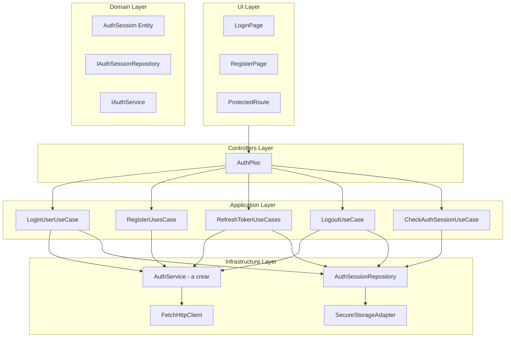

# Plan de Migración de Autenticación: Legacy → Nueva Arquitectura

## Resumen Ejecutivo

El objetivo es migrar de la arquitectura legacy de autenticación (`src/Application/Auth/`) a la nueva arquitectura (`src/Application/AuthUsesCase/`) sin romper la funcionalidad actual.

### Arquitectura Actual vs Nueva

| Aspecto          | Legacy (Actual)                | Nueva (Objetivo)                                     |
| ---------------- | ------------------------------ | ---------------------------------------------------- |
| **Persistencia** | LocalStorageAdapter            | SecureStorageAdapter (via AuthSessionRepository)     |
| **Tokens**       | Interfaz básica sin validación | Entity AuthSession con validación e inmutabilidad    |
| **Refresh**      | Retorna nuevos tokens          | Actualización inmutable manteniendo datos de usuario |
| **Usuario**      | Fetch adicional tras login     | Decodificación JWT directa                           |
| **Seguridad**    | Almacenamiento no seguro       | Almacenamiento seguro                                |

---

## Diagrama de Arquitectura Objetivo



---

## Fases de Implementación

### Fase 1: Crear AuthService (Puerto de Infraestructura)

**Objetivo**: Implementar `IAuthService` que conecte los nuevos use cases con `FetchHttpClient`.

**Archivo a crear**: `src/Infrastructure/Services/AuthService.ts`

```typescript
// Estructura prevista
export class AuthService implements IAuthService {
    private readonly httpClient: IHttpClient;

    constructor(httpClient: IHttpClient) { ... }

    async login(request: ILoginRequest): Promise<ILoginResponse | ILoginResponseError> { ... }
    async register(request: IRegisterRequest): Promise<IRegisterResponse | ILoginResponseError> { ... }
    async refreshToken(request: IRefreshTokenRequest): Promise<IRefreshTokenResponse | IRefreshTokenResponseError> { ... }
    // ... resto de métodos
}
```

**Decisiones de diseño**:

- Mantener compatibilidad con API actual (`thtracker-api.onrender.com`)
- Manejar errores según el patrón RFC 7807 (ProblemDetails)
- Retornar tipos discriminated unions para facilitar manejo de errores

---

### Fase 2: Actualizar DependenciesLocator

**Objetivo**: Instanciar los nuevos use cases y conectarlos.

**Cambios en**: `src/Infrastructure/DI/DependenciesLocator.ts`

```typescript
// Nuevas importaciones
import { AuthService } from '../Services/AuthService';
import {
  LoginUserUseCase,
  RefreshTokenUseCases,
  RegisterUseCases,
  LogoutUseCase,
  CheckAuthSessionUseCase,
} from '../../Application/AuthUsesCase';

// Nuevas instancias
const authService = new AuthService(httpClient);

const loginUserUseCase = new LoginUserUseCase(authService, authSessionRepository);
const registerUseCases = new RegisterUseCases(authService);
const refreshTokenUseCases = new RefreshTokenUseCases(authService, authSessionRepository);
const logoutUseCase = new LogoutUseCase(authSessionRepository, authService);
const checkAuthSessionUseCase = new CheckAuthSessionUseCase(authSessionRepository);
```

**Nota**: Mantener las instancias legacy durante la transición para rollback si es necesario.

---

### Fase 3: Modificar AuthPloc

**Objetivo**: Migrar AuthPloc gradualmente para usar la nueva arquitectura.

**Cambios en**: `src/Controllers/Auth/AuthPloc.ts`

**Antes (Legacy)**:

```typescript
constructor(
    loginUseCase: LoginUseCase,
    registerUseCase: RegisterUseCase,
    refreshTokenUseCase: RefreshTokenUseCase,
    getSessionUserUseCase: GetSessionUserUseCase,
    storage: IStorage  // LocalStorageAdapter
)
```

**Después (Nueva)**:

```typescript
constructor(
    loginUserUseCase: LoginUserUseCase,
    registerUseCases: RegisterUseCases,
    refreshTokenUseCases: RefreshTokenUseCases,
    logoutUseCase: LogoutUseCase,
    checkAuthSessionUseCase: CheckAuthSessionUseCase,
    authSessionRepository: IAuthSessionRepository  // SecureStorage via Repository
)
```

---

### Fase 4: Migrar método login()

**Antes**:

```typescript
async login(request: LoginRequest): Promise<void> {
    this.changeState({ ...this.state, status: AuthStatus.AUTHENTICATING });
    const token = await this.loginUseCase.execute(request);
    await this.handleAuthenticationSuccess(token);  // Persiste en LocalStorage
    const user = await this.getSessionUserUseCase.execute();  // Fetch adicional
}
```

**Después**:

```typescript
async login(request: ILoginRequest): Promise<void> {
    this.changeState({ ...this.state, status: AuthStatus.AUTHENTICATING });
    const result = await this.loginUserUseCase.execute(request);

    if (isLoginSuccess(result)) {
        // AuthSession ya persistida en SecureStorage por el use case
        this.changeState({
            status: AuthStatus.AUTHENTICATED,
            user: result.user,
            error: undefined
        });
    } else {
        this.changeState({
            status: AuthStatus.FAILED,
            error: result.error || 'Credenciales inválidas'
        });
    }
}
```

**Ventajas**:

- No requiere fetch adicional para obtener usuario (decodificación JWT)
- Persistencia automática en SecureStorage
- Validación de entidad garantizada

---

### Fase 5: Migrar método init()

**Antes**:

```typescript
async init(): Promise<void> {
    const persistedToken = await this.storage.get(STORAGE_KEY);
    if (!persistedToken) { ... }
    const newToken = await this.refreshTokenUseCase.execute(persistedToken.refreshToken);
}
```

**Después**:

```typescript
async init(): Promise<void> {
    const { isAuthenticated, session } = await this.checkAuthSessionUseCase.execute();

    if (!isAuthenticated || !session) {
        this.changeState({ ...this.state, status: AuthStatus.UNAUTHENTICATED });
        return;
    }

    if (session.needsRefresh()) {
        this.changeState({ ...this.state, status: AuthStatus.REFRESHING_TOKEN });
        const result = await this.refreshTokenUseCases.execute({ refreshToken: session.refreshToken });
        // Nueva sesión ya persistida por el use case
    }

    this.changeState({
        status: AuthStatus.AUTHENTICATED,
        user: session.user,
        error: undefined
    });
}
```

---

### Fase 6: Migrar método logout()

**Antes**:

```typescript
async logout(): Promise<void> {
    this.storage.remove(STORAGE_KEY);
    this.changeState(initialAuthState);
}
```

**Después**:

```typescript
async logout(): Promise<void> {
    this.changeState({ ...this.state, status: AuthStatus.LOGGING_OUT });
    await this.logoutUseCase.execute({ notifyServer: true });
    this.changeState(initialAuthState);
}
```

---

### Fase 7: Ejecutar Tests y Verificar

**Tests a ejecutar**:

```bash
npm test
```

**Verificaciones**:

- Tests existentes pasan (AuthPloc.test.ts, LoginUseCase.test.ts, etc.)
- Funcionalidad de login funciona
- Funcionalidad de logout funciona
- Persistencia funciona (verificar en devtools)
- Refresh de token funciona

---

### Fase 8: Limpieza (Post-migración)

**Archivos a eliminar** (después de verificar migración):

- `src/Application/Auth/` (legacy use cases) - mantener temporalmente
- `src/Controllers/Auth/AuthPloc.ts` (versión legacy)
- Dependencias de LocalStorageAdapter en autenticación

---

## Manejo de Errores

### Errores de HTTP

La nueva arquitectura distingue entre respuestas exitosas y de error:

```typescript
// LoginUseCases retorna ILoginResponse | ILoginResponseError
const result = await loginUserUseCase.execute(request);

if ('accessToken' in result) {
  // Éxito
} else {
  // Error: result.error, result.message, etc.
}
```

### Mapear errores legacy a nuevos

El AuthPloc debe mantener compatibilidad con el estado `AuthStatus.FAILED` y la propiedad `error`.

---

## Compatibilidad con API

El API actual (`https://thtracker-api.onrender.com`) debe seguir funcionando. La nueva arquitectura:

1. Usa los mismos endpoints:
   - `POST /api/v1/auth/login`
   - `POST /api/v1/auth/register`
   - `POST /api/v1/auth/refresh`
   - `GET /api/v1/users/me`

2. Maneja los mismos formatos de respuesta
3. Usa el mismo `FetchHttpClient` con interceptors de token

---

## Matriz de Cambios

| Componente          | Acción     | Riesgo | Dependencias              |
| ------------------- | ---------- | ------ | ------------------------- |
| AuthService         | Crear      | Bajo   | IHttpClient, IAuthService |
| DependenciesLocator | Actualizar | Medio  | Ninguno                   |
| AuthPloc            | Reescribir | Alto   | Tests                     |
| Tests               | Actualizar | Bajo   | Ninguno                   |

---

## Rollback Plan

Si la migración falla:

1. DependenciesLocator mantiene referencia a use cases legacy
2. AuthPloc puede recibir ambos tipos de use cases (factory)
3. LocalStorage sigue funcionando como fallback

---

## Conclusión

Este plan permite una migración gradual y segura de la arquitectura legacy a la nueva:

1. **Fase 1-2**: Conectar la infraestructura (bajo riesgo)
2. **Fase 3-6**: Migrar AuthPloc (alto riesgo, requiere tests)
3. **Fase 7**: Verificar funcionamiento
4. **Fase 8**: Limpiar código legacy

La clave es mantener compatibilidad hacia atrás durante la transición y ejecutar tests frecuentemente.
